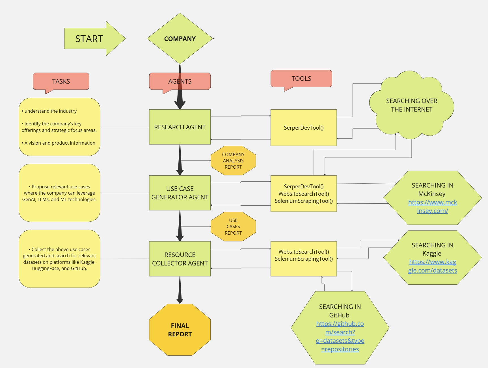

# CreationScope

## Market Research & Use case Generation

Our multi-agent AI system operates as your intelligent research assistant, powered by three specialized agents working in harmony. When you input a company name, the Research Agent first scours the internet to gather comprehensive information about the company's core business and strategic focus. This intelligence is then passed to our Use Case Generator Agent, which analyzes the data to identify promising opportunities for implementing AI technologies like GenAI, LLMs, and ML solutions within the company's context. Finally, our Resource Collector Agent steps in to locate relevant datasets, models, and implementation resources from platforms like Kaggle, HuggingFace, and GitHub, ensuring that each proposed AI solution has practical resources to support its implementation. The entire process culminates in a detailed report that bridges the gap between possibility and practicality in AI adoption.

<details open="open">
  <summary>Table of Contents</summary>
  <ol>
    <li>
      <a href="#Approach">Approach</a>
    </li>
    <li>
      <a href="#Technologies">Technologies</a>
    </li>
    <li>
      <a href="Project Workflow">Workflow</a>
    </li>
    <li>
	    <a href = "#How-to-Start-Project">How to Start Project</a>
    </li>
    <li>
	    <a href = "#Contact-Us">Contact Us</a>
    </li>
  </ol>
</details>

## Approach
Our approach leverages Crew AI's multi-agent architecture to create an intelligent system that breaks down complex AI implementation analysis into manageable, specialized tasks. Each agent in our system acts as an expert in its domain - from company research to use case generation and resource collection. Through this orchestrated workflow, the agents work in harmony: gathering comprehensive company information, analyzing AI implementation possibilities focusing on GenAI and LLMs, and matching these opportunities with practical resources from leading platforms. This systematic division of responsibilities ensures both efficiency and thoroughness in delivering actionable AI implementation strategies.

## Technologies
- Python
- Streamlit
- CrewAI
- Langchain

## Project Workflow:

<div style="display:flex; flex-wrap:wrap; gap:2%; justify-content:center;">

</div>

## How to Start Project

Follow these steps to get started with the project:

1. **Clone the Repository:**
   ```bash
   git clone <repository_link>
   ```
2. **Install Anaconda:**
   
   Make sure you have Anaconda installed on your system. If not, you can download and install it from the official website: https://www.anaconda.com/download/
   
4. **Create a Virtual Environment:**
   
   Create a new virtual environment using Python 3.10:

   ```bash
   conda create --name your_env_name python=3.10 -y
   ```
   Replace your_env_name with the desired name for your virtual environment.
   
   Activate the newly created environment:
   ```bash
   conda activate your_env_name
   ```
5. **Install Dependencies:**
   
   Install the project dependencies by running:
   ```bash
   pip install -r requirements.txt
   ```
   lock the dependencies and then install them:
   ```bash
   poetry lock
   ```
   ```bash
   poetry install
   ```
   This command will install all the required packages listed in the requirements.txt file.

6. **\.env file**
    create .env file and put all required API Keys inside it.

7. **Run the Streamlit App:**
   ```bash
   streamlit run Creation_Scope.py
   ```
   This command will start the Streamlit app.

## Contact Us

To learn more about, please reach out:

📧 suzalkachhadiya111@gmail.com